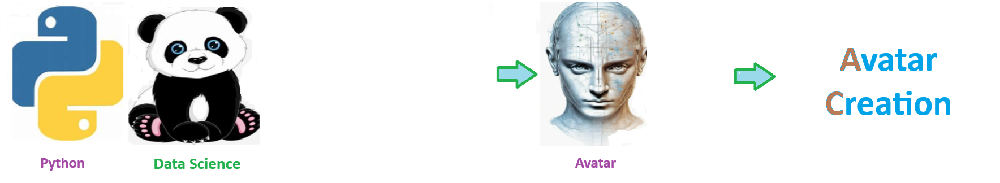

    
# Avatar Creation 

## Learning how to trade GOLD futures 

    
## Code Features

1. Self Documenting  Automatically identifes major steps in notebook
2. Self Testing  Unit Testing for each function
3. Easily Configurable  Easily modify with config.INI  keyname value pairs
4. Includes Talking Code  The code explains itself
5. Self Logging  Enhanced python standard logging
6. Self Debugging  Enhanced python standard debugging
7. Low Code  or  No Code  Most solutions are under 50 lines of code
8. Educational  Includes educational dialogue and background material
## Code Features

1. Self Documenting  Automatically identifes major steps in notebook
2. Self Testing  Unit Testing for each function
3. Easily Configurable  Easily modify with config.INI  keyname value pairs
4. Includes Talking Code  The code explains itself
5. Self Logging  Enhanced python standard logging
6. Self Debugging  Enhanced python standard debugging
7. Low Code  or  No Code  Most solutions are under 50 lines of code
8. Educational  Includes educational dialogue and background material
## Code Features

1. Self Documenting  Automatically identifes major steps in notebook
2. Self Testing  Unit Testing for each function
3. Easily Configurable  Easily modify with config.INI  keyname value pairs
4. Includes Talking Code  The code explains itself
5. Self Logging  Enhanced python standard logging
6. Self Debugging  Enhanced python standard debugging
7. Low Code  or  No Code  Most solutions are under 50 lines of code
8. Educational  Includes educational dialogue and background material
## Code Features

1. Self Documenting  Automatically identifes major steps in notebook
2. Self Testing  Unit Testing for each function
3. Easily Configurable  Easily modify with config.INI  keyname value pairs
4. Includes Talking Code  The code explains itself
5. Self Logging  Enhanced python standard logging
6. Self Debugging  Enhanced python standard debugging
7. Low Code  or  No Code  Most solutions are under 50 lines of code
8. Educational  Includes educational dialogue and background material
## Code Features

1. Self Documenting  Automatically identifes major steps in notebook
2. Self Testing  Unit Testing for each function
3. Easily Configurable  Easily modify with config.INI  keyname value pairs
4. Includes Talking Code  The code explains itself
5. Self Logging  Enhanced python standard logging
6. Self Debugging  Enhanced python standard debugging
7. Low Code  or  No Code  Most solutions are under 50 lines of code
8. Educational  Includes educational dialogue and background material
## Code Features

1. Self Documenting  Automatically identifes major steps in notebook
2. Self Testing  Unit Testing for each function
3. Easily Configurable  Easily modify with config.INI  keyname value pairs
4. Includes Talking Code  The code explains itself
5. Self Logging  Enhanced python standard logging
6. Self Debugging  Enhanced python standard debugging
7. Low Code  or  No Code  Most solutions are under 50 lines of code
8. Educational  Includes educational dialogue and background material
## Code Features

1. Self Documenting  Automatically identifes major steps in notebook
2. Self Testing  Unit Testing for each function
3. Easily Configurable  Easily modify with config.INI  keyname value pairs
4. Includes Talking Code  The code explains itself
5. Self Logging  Enhanced python standard logging
6. Self Debugging  Enhanced python standard debugging
7. Low Code  or  No Code  Most solutions are under 50 lines of code
8. Educational  Includes educational dialogue and background material
## Code Features

1. Self Documenting  Automatically identifes major steps in notebook
2. Self Testing  Unit Testing for each function
3. Easily Configurable  Easily modify with config.INI  keyname value pairs
4. Includes Talking Code  The code explains itself
5. Self Logging  Enhanced python standard logging
6. Self Debugging  Enhanced python standard debugging
7. Low Code  or  No Code  Most solutions are under 50 lines of code
8. Educational  Includes educational dialogue and background material
## Code Features

1. Self Documenting  Automatically identifes major steps in notebook
2. Self Testing  Unit Testing for each function
3. Easily Configurable  Easily modify with config.INI  keyname value pairs
4. Includes Talking Code  The code explains itself
5. Self Logging  Enhanced python standard logging
6. Self Debugging  Enhanced python standard debugging
7. Low Code  or  No Code  Most solutions are under 50 lines of code
8. Educational  Includes educational dialogue and background material
## Code Features

1. ***Self Documenting***  Automatically identifes major steps in notebook
2. ***Self Testing***  Unit Testing for each function
3. ***Easily Configurable***  Easily modify with config.INI  keyname value pairs
4. ***Includes Talking Code***  The code explains itself
5. ***Self Logging***  Enhanced python standard logging
6. ***Self Debugging***  Enhanced python standard debugging
7. ***Low Code  or  No Code***  Most solutions are under 50 lines of code
8. ***Educational***  Includes educational dialogue and background material
## Code Features

1. **Self Documenting**  Automatically identifes major steps in notebook
2. **Self Testing**  Unit Testing for each function
3. **Easily Configurable**  Easily modify with config.INI  keyname value pairs
4. **Includes Talking Code**  The code explains itself
5. **Self Logging**  Enhanced python standard logging
6. **Self Debugging**  Enhanced python standard debugging
7. **Low Code  or  No Code**  Most solutions are under 50 lines of code
8. **Educational**  Includes educational dialogue and background material
🧠 AI Solution Template — Jumpstart Your Intelligent Projects
The solution_template is a powerful, lightweight starting point designed to accelerate the development of AIdriven solutions. 

Whether youre building models, automating workflows, or exploring data, this template provides a readytogo structure that emphasizes clarity
, reliability, and adaptability.

## 🧠 AI Solution Template — Jumpstart Your Intelligent Projects
The **solution_template** is a powerful, lightweight starting point designed to accelerate the development of AIdriven solutions. 

Whether youre building models, automating workflows, or exploring data, this template provides a readytogo structure that emphasizes clarity
, reliability, and adaptability.

## ⚙️ Key Features

1. **SelfDocumenting  Automatically identifies and outlines major steps, making notebooks easy to follow.
2. **SelfTesting  Builtin unit tests ensure each function performs as expected, promoting code integrity.
3. **Easily Configurable  Uses a simple config.ini for centralized keyvalue pair settings.
4. **Talking Code  Code includes descriptive explanations, helping users understand both what it does and why.
5. **SelfLogging  Enhanced logging built on Pythons logging module provides clear execution tracking.
6. **SelfDebugging  Adds introspection and diagnostics to streamline troubleshooting.
7. **Low Code  No Code  Designed to keep solutions concise, most use cases are implemented in fewer than 50 lines.
8. **Educational  Embedded educational commentary and background materials support learning and onboarding.

## ⚙️ Key Features

1. **SelfDocumenting**  Automatically identifies and outlines major steps, making notebooks easy to follow.
2. **SelfTesting**  Builtin unit tests ensure each function performs as expected, promoting code integrity.
3. **Easily Configurable**  Uses a simple config.ini for centralized keyvalue pair settings.
4. **Talking Code**  Code includes descriptive explanations, helping users understand both what it does and why.
5. **SelfLogging**  Enhanced logging built on Pythons logging module provides clear execution tracking.
6. **SelfDebugging**  Adds introspection and diagnostics to streamline troubleshooting.
7. **Low Code  No Code**  Designed to keep solutions concise, most use cases are implemented in fewer than 50 lines.
8. **Educational**  Embedded educational commentary and background materials support learning and onboarding.

## ⚙️ Key Features

1. **Self Documenting**  Automatically identifies and outlines major steps, making notebooks easy to follow.
2. **Self Testing**  Builtin unit tests ensure each function performs as expected, promoting code integrity.
3. **Easily Configurable**  Uses a simple config.ini for centralized keyvalue pair settings.
4. **Talking Code**  Code includes descriptive explanations, helping users understand both what it does and why.
5. **Self Logging**  Enhanced logging built on Pythons logging module provides clear execution tracking.
6. **Self Debugging**  Adds introspection and diagnostics to streamline troubleshooting.
7. **Low Code  No Code**  Designed to keep solutions concise, most use cases are implemented in fewer than 50 lines.
8. **Educational**  Embedded educational commentary and background materials support learning and onboarding.

# 🧠 AI Solution Template

A lightweight, modular template to jumpstart AIdriven projects with clarity, speed, and structure. This solution template is perfect for data scientists, engineers, and learners looking to build intelligent systems quickly and maintainably.

## ⚙️ Features

### ✅ SelfDocumenting
Automatically identifies and annotates major steps in a notebook, making the codebase readable and wellstructured.

### ✅ SelfTesting
Includes builtin unit tests for each function to validate logic and ensure code reliability.

### ✅ Easily Configurable
Uses a simple `config.ini` file for centralized settings and easy customization through keyvalue pairs.

### ✅ Talking Code
The code explains itself through inline commentary, helping you (or your team) understand both *what* it does and *why* it does it.

### ✅ SelfLogging
Enhanced logging capabilities using Pythons standard `logging` module for stepbystep runtime insights.

### ✅ SelfDebugging
Includes debugging hooks and detailed error tracing to simplify development and troubleshooting.

### ✅ Low Code  No Code
Designed to minimize complexity — most full solutions are under 50 lines of code.

### ✅ Educational
Each template includes educational narrative and background context to support learning, teaching, and collaborative development.

# 🧠 AI Solution Template

A lightweight, modular template to jumpstart AIdriven projects with clarity, speed, and structure. This solution template is perfect for data scientists, engineers, and learners looking to build intelligent systems quickly and maintainably.

## ⚙️ Features

### ✅ Self Documenting
Automatically identifies and annotates major steps in a notebook, making the codebase readable and wellstructured.

### ✅ Self Testing
Includes builtin unit tests for each function to validate logic and ensure code reliability.

### ✅ Easily Configurable
Uses a simple `config.ini` file for centralized settings and easy customization through keyvalue pairs.

### ✅ Talking Code
The code explains itself through inline commentary, helping you (or your team) understand both *what* it does and *why* it does it.

### ✅ Self Logging
Enhanced logging capabilities using Pythons standard `logging` module for stepbystep runtime insights.

### ✅ Self Debugging
Includes debugging hooks and detailed error tracing to simplify development and troubleshooting.

### ✅ Low Code or  No Code
Designed to minimize complexity — most full solutions are under 50 lines of code.

### ✅ Educational
Each template includes educational narrative and background context to support learning, teaching, and collaborative development.

# 🧩 Solution Template

> A modular, AIfirst solution scaffold  
> Created by **ThriveAI  Joe Eberle**  
> 🗓️ Started April 18, 2025 
> 📫 Contact [josepheberle@outlook.com](mailtojosepheberle@outlook.com)  
> 🔗 GitHub [JoeEberle](httpsgithub.comJoeEberle)

# 🧩 Solution Template

#### A modular, AI first solution scaffold  

> Created by **ThriveAI  Joe Eberle**  
> 🗓️ Started April 18, 2025 
> 📫 Contact [josepheberle@outlook.com](mailtojosepheberle@outlook.com)  
> 🔗 GitHub [JoeEberle](httpsgithub.comJoeEberle)

# 🧩 Solution Template

#### A modular, AI first solution scaffold  

> Created by **ThriveAI     Joe Eberle**  
> 🗓️ Started April 18, 2025 
> 📫 Contact [josepheberle@outlook.com](mailtojosepheberle@outlook.com)  
> 🔗 GitHub [JoeEberle](httpsgithub.comJoeEberle)

# 🧩 Solution Template

#### A modular, AI first solution scaffold  

> Created by **ThriveAI     Joe Eberle**  
> 🗓️ Started April 18, 2025 
> 📫 Contact [josepheberle@outlook.com](mailtojosepheberle@outlook.com)  
> 🔗 GitHub [JoeEberle](httpsgithub.comJoeEberle)

# 🧩 Solution Template

#### A modular, AI first solution scaffold  

> Created by **ThriveAI        Joe Eberle**  
> 🗓️ Started April 18, 2025 
> 📫 Contact [josepheberle@outlook.com](mailtojosepheberle@outlook.com)  
> 🔗 GitHub [JoeEberle](httpsgithub.comJoeEberle)

# 🧩 Solution Template

#### A modular, AI first solution scaffold  

> Created by **ThriveAI  ...      Joe Eberle**  
> 🗓️ Started April 18, 2025 
> 📫 Contact [josepheberle@outlook.com](mailtojosepheberle@outlook.com)  
> 🔗 GitHub [JoeEberle](httpsgithub.comJoeEberle)

# 🧠 AI Solution Template

A lightweight, modular template to jumpstart AIdriven projects with clarity, speed, and structure. This solution template is perfect for data scientists, engineers, and learners looking to build intelligent systems quickly and maintainably.

## ⚙️ Key Features

### ✅ Self Documenting
Automatically identifies and annotates major steps in a notebook, making the codebase readable and wellstructured.

### ✅ Self Testing
Includes builtin unit tests for each function to validate logic and ensure code reliability.

### ✅ Easily Configurable
Uses a simple `config.ini` file for centralized settings and easy customization through keyvalue pairs.

### ✅ Talking Code
The code explains itself through inline commentary, helping you (or your team) understand both *what* it does and *why* it does it.

### ✅ Self Logging
Enhanced logging capabilities using Pythons standard `logging` module for stepbystep runtime insights.

### ✅ Self Debugging
Includes debugging hooks and detailed error tracing to simplify development and troubleshooting.

### ✅ Low Code or  No Code
Designed to minimize complexity — most full solutions are under 50 lines of code.

### ✅ Educational
Each template includes educational narrative and background context to support learning, teaching, and collaborative development.

Welcome to the solution **Avatar Creation** 

Learning how to trade GOLD futures 

 
## Code Features

1. Self Documenting  Automatically identifes major steps in notebook
2. Self Testing  Unit Testing for each function
3. Easily Configurable  Easily modify with config.INI  keyname value pairs
4. Includes Talking Code  The code explains itself
5. Self Logging  Enhanced python standard logging
6. Self Debugging  Enhanced python standard debugging
7. Low Code  or  No Code  Most solutions are under 50 lines of code
8. Educational  Includes educational dialogue and background material
## Code Features

1. Self Documenting  Automatically identifes major steps in notebook
2. Self Testing  Unit Testing for each function
3. Easily Configurable  Easily modify with config.INI  keyname value pairs
4. Includes Talking Code  The code explains itself
5. Self Logging  Enhanced python standard logging
6. Self Debugging  Enhanced python standard debugging
7. Low Code  or  No Code  Most solutions are under 50 lines of code
8. Educational  Includes educational dialogue and background material
## Code Features

1. Self Documenting  Automatically identifes major steps in notebook
2. Self Testing  Unit Testing for each function
3. Easily Configurable  Easily modify with config.INI  keyname value pairs
4. Includes Talking Code  The code explains itself
5. Self Logging  Enhanced python standard logging
6. Self Debugging  Enhanced python standard debugging
7. Low Code  or  No Code  Most solutions are under 50 lines of code
8. Educational  Includes educational dialogue and background material
## Code Features

1. Self Documenting  Automatically identifes major steps in notebook
2. Self Testing  Unit Testing for each function
3. Easily Configurable  Easily modify with config.INI  keyname value pairs
4. Includes Talking Code  The code explains itself
5. Self Logging  Enhanced python standard logging
6. Self Debugging  Enhanced python standard debugging
7. Low Code  or  No Code  Most solutions are under 50 lines of code
8. Educational  Includes educational dialogue and background material
## Code Features

1. Self Documenting  Automatically identifes major steps in notebook
2. Self Testing  Unit Testing for each function
3. Easily Configurable  Easily modify with config.INI  keyname value pairs
4. Includes Talking Code  The code explains itself
5. Self Logging  Enhanced python standard logging
6. Self Debugging  Enhanced python standard debugging
7. Low Code  or  No Code  Most solutions are under 50 lines of code
8. Educational  Includes educational dialogue and background material
## Code Features

1. Self Documenting  Automatically identifes major steps in notebook
2. Self Testing  Unit Testing for each function
3. Easily Configurable  Easily modify with config.INI  keyname value pairs
4. Includes Talking Code  The code explains itself
5. Self Logging  Enhanced python standard logging
6. Self Debugging  Enhanced python standard debugging
7. Low Code  or  No Code  Most solutions are under 50 lines of code
8. Educational  Includes educational dialogue and background material
## Code Features

1. Self Documenting  Automatically identifes major steps in notebook
2. Self Testing  Unit Testing for each function
3. Easily Configurable  Easily modify with config.INI  keyname value pairs
4. Includes Talking Code  The code explains itself
5. Self Logging  Enhanced python standard logging
6. Self Debugging  Enhanced python standard debugging
7. Low Code  or  No Code  Most solutions are under 50 lines of code
8. Educational  Includes educational dialogue and background material
## Code Features

1. Self Documenting  Automatically identifes major steps in notebook
2. Self Testing  Unit Testing for each function
3. Easily Configurable  Easily modify with config.INI  keyname value pairs
4. Includes Talking Code  The code explains itself
5. Self Logging  Enhanced python standard logging
6. Self Debugging  Enhanced python standard debugging
7. Low Code  or  No Code  Most solutions are under 50 lines of code
8. Educational  Includes educational dialogue and background material
## Code Features

1. Self Documenting  Automatically identifes major steps in notebook
2. Self Testing  Unit Testing for each function
3. Easily Configurable  Easily modify with config.INI  keyname value pairs
4. Includes Talking Code  The code explains itself
5. Self Logging  Enhanced python standard logging
6. Self Debugging  Enhanced python standard debugging
7. Low Code  or  No Code  Most solutions are under 50 lines of code
8. Educational  Includes educational dialogue and background material
## Code Features

1. ***Self Documenting***  Automatically identifes major steps in notebook
2. ***Self Testing***  Unit Testing for each function
3. ***Easily Configurable***  Easily modify with config.INI  keyname value pairs
4. ***Includes Talking Code***  The code explains itself
5. ***Self Logging***  Enhanced python standard logging
6. ***Self Debugging***  Enhanced python standard debugging
7. ***Low Code  or  No Code***  Most solutions are under 50 lines of code
8. ***Educational***  Includes educational dialogue and background material
## Code Features

1. **Self Documenting**  Automatically identifes major steps in notebook
2. **Self Testing**  Unit Testing for each function
3. **Easily Configurable**  Easily modify with config.INI  keyname value pairs
4. **Includes Talking Code**  The code explains itself
5. **Self Logging**  Enhanced python standard logging
6. **Self Debugging**  Enhanced python standard debugging
7. **Low Code  or  No Code**  Most solutions are under 50 lines of code
8. **Educational**  Includes educational dialogue and background material
🧠 AI Solution Template — Jumpstart Your Intelligent Projects
The solution_template is a powerful, lightweight starting point designed to accelerate the development of AIdriven solutions. 

Whether youre building models, automating workflows, or exploring data, this template provides a readytogo structure that emphasizes clarity
, reliability, and adaptability.

## 🧠 AI Solution Template — Jumpstart Your Intelligent Projects
The **solution_template** is a powerful, lightweight starting point designed to accelerate the development of AIdriven solutions. 

Whether youre building models, automating workflows, or exploring data, this template provides a readytogo structure that emphasizes clarity
, reliability, and adaptability.

## ⚙️ Key Features

1. **SelfDocumenting  Automatically identifies and outlines major steps, making notebooks easy to follow.
2. **SelfTesting  Builtin unit tests ensure each function performs as expected, promoting code integrity.
3. **Easily Configurable  Uses a simple config.ini for centralized keyvalue pair settings.
4. **Talking Code  Code includes descriptive explanations, helping users understand both what it does and why.
5. **SelfLogging  Enhanced logging built on Pythons logging module provides clear execution tracking.
6. **SelfDebugging  Adds introspection and diagnostics to streamline troubleshooting.
7. **Low Code  No Code  Designed to keep solutions concise, most use cases are implemented in fewer than 50 lines.
8. **Educational  Embedded educational commentary and background materials support learning and onboarding.

## ⚙️ Key Features

1. **SelfDocumenting**  Automatically identifies and outlines major steps, making notebooks easy to follow.
2. **SelfTesting**  Builtin unit tests ensure each function performs as expected, promoting code integrity.
3. **Easily Configurable**  Uses a simple config.ini for centralized keyvalue pair settings.
4. **Talking Code**  Code includes descriptive explanations, helping users understand both what it does and why.
5. **SelfLogging**  Enhanced logging built on Pythons logging module provides clear execution tracking.
6. **SelfDebugging**  Adds introspection and diagnostics to streamline troubleshooting.
7. **Low Code  No Code**  Designed to keep solutions concise, most use cases are implemented in fewer than 50 lines.
8. **Educational**  Embedded educational commentary and background materials support learning and onboarding.

## ⚙️ Key Features

1. **Self Documenting**  Automatically identifies and outlines major steps, making notebooks easy to follow.
2. **Self Testing**  Builtin unit tests ensure each function performs as expected, promoting code integrity.
3. **Easily Configurable**  Uses a simple config.ini for centralized keyvalue pair settings.
4. **Talking Code**  Code includes descriptive explanations, helping users understand both what it does and why.
5. **Self Logging**  Enhanced logging built on Pythons logging module provides clear execution tracking.
6. **Self Debugging**  Adds introspection and diagnostics to streamline troubleshooting.
7. **Low Code  No Code**  Designed to keep solutions concise, most use cases are implemented in fewer than 50 lines.
8. **Educational**  Embedded educational commentary and background materials support learning and onboarding.

# 🧠 AI Solution Template

A lightweight, modular template to jumpstart AIdriven projects with clarity, speed, and structure. This solution template is perfect for data scientists, engineers, and learners looking to build intelligent systems quickly and maintainably.

## ⚙️ Features

### ✅ SelfDocumenting
Automatically identifies and annotates major steps in a notebook, making the codebase readable and wellstructured.

### ✅ SelfTesting
Includes builtin unit tests for each function to validate logic and ensure code reliability.

### ✅ Easily Configurable
Uses a simple `config.ini` file for centralized settings and easy customization through keyvalue pairs.

### ✅ Talking Code
The code explains itself through inline commentary, helping you (or your team) understand both *what* it does and *why* it does it.

### ✅ SelfLogging
Enhanced logging capabilities using Pythons standard `logging` module for stepbystep runtime insights.

### ✅ SelfDebugging
Includes debugging hooks and detailed error tracing to simplify development and troubleshooting.

### ✅ Low Code  No Code
Designed to minimize complexity — most full solutions are under 50 lines of code.

### ✅ Educational
Each template includes educational narrative and background context to support learning, teaching, and collaborative development.

# 🧠 AI Solution Template

A lightweight, modular template to jumpstart AIdriven projects with clarity, speed, and structure. This solution template is perfect for data scientists, engineers, and learners looking to build intelligent systems quickly and maintainably.

## ⚙️ Features

### ✅ Self Documenting
Automatically identifies and annotates major steps in a notebook, making the codebase readable and wellstructured.

### ✅ Self Testing
Includes builtin unit tests for each function to validate logic and ensure code reliability.

### ✅ Easily Configurable
Uses a simple `config.ini` file for centralized settings and easy customization through keyvalue pairs.

### ✅ Talking Code
The code explains itself through inline commentary, helping you (or your team) understand both *what* it does and *why* it does it.

### ✅ Self Logging
Enhanced logging capabilities using Pythons standard `logging` module for stepbystep runtime insights.

### ✅ Self Debugging
Includes debugging hooks and detailed error tracing to simplify development and troubleshooting.

### ✅ Low Code or  No Code
Designed to minimize complexity — most full solutions are under 50 lines of code.

### ✅ Educational
Each template includes educational narrative and background context to support learning, teaching, and collaborative development.

# 🧩 Solution Template

> A modular, AIfirst solution scaffold  
> Created by **ThriveAI  Joe Eberle**  
> 🗓️ Started April 18, 2025 
> 📫 Contact [josepheberle@outlook.com](mailtojosepheberle@outlook.com)  
> 🔗 GitHub [JoeEberle](httpsgithub.comJoeEberle)

# 🧩 Solution Template

#### A modular, AI first solution scaffold  

> Created by **ThriveAI  Joe Eberle**  
> 🗓️ Started April 18, 2025 
> 📫 Contact [josepheberle@outlook.com](mailtojosepheberle@outlook.com)  
> 🔗 GitHub [JoeEberle](httpsgithub.comJoeEberle)

# 🧩 Solution Template

#### A modular, AI first solution scaffold  

> Created by **ThriveAI     Joe Eberle**  
> 🗓️ Started April 18, 2025 
> 📫 Contact [josepheberle@outlook.com](mailtojosepheberle@outlook.com)  
> 🔗 GitHub [JoeEberle](httpsgithub.comJoeEberle)

# 🧩 Solution Template

#### A modular, AI first solution scaffold  

> Created by **ThriveAI     Joe Eberle**  
> 🗓️ Started April 18, 2025 
> 📫 Contact [josepheberle@outlook.com](mailtojosepheberle@outlook.com)  
> 🔗 GitHub [JoeEberle](httpsgithub.comJoeEberle)

# 🧩 Solution Template

#### A modular, AI first solution scaffold  

> Created by **ThriveAI        Joe Eberle**  
> 🗓️ Started April 18, 2025 
> 📫 Contact [josepheberle@outlook.com](mailtojosepheberle@outlook.com)  
> 🔗 GitHub [JoeEberle](httpsgithub.comJoeEberle)

# 🧩 Solution Template

#### A modular, AI first solution scaffold  

> Created by **ThriveAI  ...      Joe Eberle**  
> 🗓️ Started April 18, 2025 
> 📫 Contact [josepheberle@outlook.com](mailtojosepheberle@outlook.com)  
> 🔗 GitHub [JoeEberle](httpsgithub.comJoeEberle)

# 🧠 AI Solution Template

A lightweight, modular template to jumpstart AIdriven projects with clarity, speed, and structure. This solution template is perfect for data scientists, engineers, and learners looking to build intelligent systems quickly and maintainably.

## ⚙️ Key Features

### ✅ Self Documenting
Automatically identifies and annotates major steps in a notebook, making the codebase readable and wellstructured.

### ✅ Self Testing
Includes builtin unit tests for each function to validate logic and ensure code reliability.

### ✅ Easily Configurable
Uses a simple `config.ini` file for centralized settings and easy customization through keyvalue pairs.

### ✅ Talking Code
The code explains itself through inline commentary, helping you (or your team) understand both *what* it does and *why* it does it.

### ✅ Self Logging
Enhanced logging capabilities using Pythons standard `logging` module for stepbystep runtime insights.

### ✅ Self Debugging
Includes debugging hooks and detailed error tracing to simplify development and troubleshooting.

### ✅ Low Code or  No Code
Designed to minimize complexity — most full solutions are under 50 lines of code.

### ✅ Educational
Each template includes educational narrative and background context to support learning, teaching, and collaborative development.

 

## Getting Started

The goal of this solution is to **Jump Start** your development and have you up and running in 30 minutes. 

To get started with the **Avatar Creation** solution repository, follow these steps:
1. Clone the repository to your local machine.
2. Install the required dependencies listed at the top of the notebook.
3. Explore the example code provided in the repository and experiment.
4. Run the notebook and make it your own - **EASY !**
    
## 🧠 Solution Features

- ✅ Easy to understand and use  
- ✅ Easily Configurable 
- ✅ Quickly start your project with pre-built templates
- ✅ Its Fast and Automated
- ✅ Saves You Time 

## ⚙️ Key Features

- ✅ **Self Documenting** Automatically identifies and annotates major steps in a notebook, making the codebase readable and well structured.
- ✅ **Self Testing** Includes built in **unit tests** for each function to validate logic and ensure code reliability.
- ✅ **Easily Configurable** Uses a simple **config.ini** file for centralized settings and easy customization through key value pairs.
- ✅ **Talking Code** explains itself through inline commentary, helping you understand both **what** it does and **why** it does it.
- ✅ **Self Logging** extends Python’s standard **logging** module for **step by step runtime insights**.
- ✅ **Self Debugging** Includes debugging hooks and detailed error tracing to simplify development and troubleshooting.
- ✅ **Low Code or  No Code** Designed to minimize complexity — most full solutions are under 50 lines of code.
- ✅ **Educational** Each template includes educational narrative and background context to support learning, teaching, and collaborative development.

    